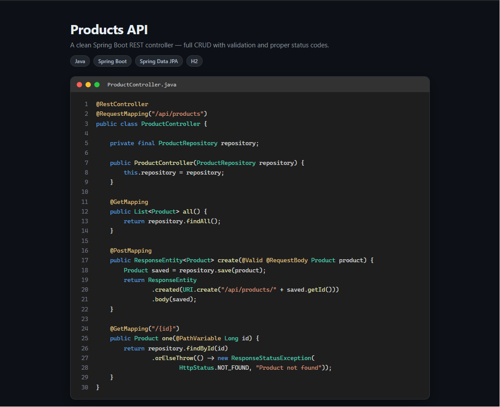

# Products API

A REST API for a small product inventory, built with **Java** and **Spring Boot**. It uses Spring
Data JPA for database access and an in-memory H2 database, and covers the full set of CRUD operations
with input validation and proper HTTP status codes.



## Endpoints

| Method | Path | Description |
| --- | --- | --- |
| GET | `/api/products` | List all products |
| GET | `/api/products/{id}` | Get a single product |
| POST | `/api/products` | Create a product — body: `{ "name": "...", "price": 9.99, "quantity": 10 }` |
| PUT | `/api/products/{id}` | Update a product |
| DELETE | `/api/products/{id}` | Delete a product |

A product looks like this:

```json
{
  "id": 1,
  "name": "Wireless Mouse",
  "price": 24.99,
  "quantity": 120
}
```

## Requirements

Java 17 or newer (built and tested with Java 21). No separate Maven install is needed — the project
ships with the Maven wrapper (`mvnw`).

## Running it

```powershell
cd D:\Projects\products-api
.\mvnw.cmd spring-boot:run
```

On macOS or Linux use `./mvnw spring-boot:run`.

The API starts on `http://localhost:8080`. On the first run the wrapper downloads Maven and the
dependencies, so give it a minute.

A few sample products are inserted automatically on startup, so the API returns data right away.

## Example requests

List all products:

```bash
curl http://localhost:8080/api/products
```

Create a product:

```bash
curl -X POST http://localhost:8080/api/products -H "Content-Type: application/json" -d "{\"name\": \"Desk Lamp\", \"price\": 19.90, \"quantity\": 50}"
```

Update a product:

```bash
curl -X PUT http://localhost:8080/api/products/1 -H "Content-Type: application/json" -d "{\"name\": \"Wireless Mouse\", \"price\": 21.99, \"quantity\": 100}"
```

Delete a product:

```bash
curl -X DELETE http://localhost:8080/api/products/1
```

## Validation and status codes

- `201 Created` when a product is created
- `200 OK` for successful reads and updates
- `204 No Content` when a product is deleted
- `400 Bad Request` when the input is invalid (blank name, negative price or quantity)
- `404 Not Found` when the product does not exist

## Database console

While the app is running you can browse the H2 database at
<http://localhost:8080/h2-console> (JDBC URL `jdbc:h2:mem:products`, user `sa`, no password).

## Project layout

```
products-api/
  src/main/java/com/pyflowlabs/productsapi/
    ProductsApiApplication.java   application entry point
    Product.java                  JPA entity + validation rules
    ProductRepository.java        Spring Data repository
    ProductController.java        REST endpoints
    DataSeeder.java               inserts sample data on startup
  src/main/resources/
    application.properties        database configuration
  pom.xml                         Maven build file
  mvnw, mvnw.cmd                  Maven wrapper
```

## Notes

The H2 database is in-memory, so the data resets on every restart — handy for a demo. Every request
body is validated before it reaches the database, and Spring Data JPA uses parameter binding
throughout, so the API is safe against SQL injection.
